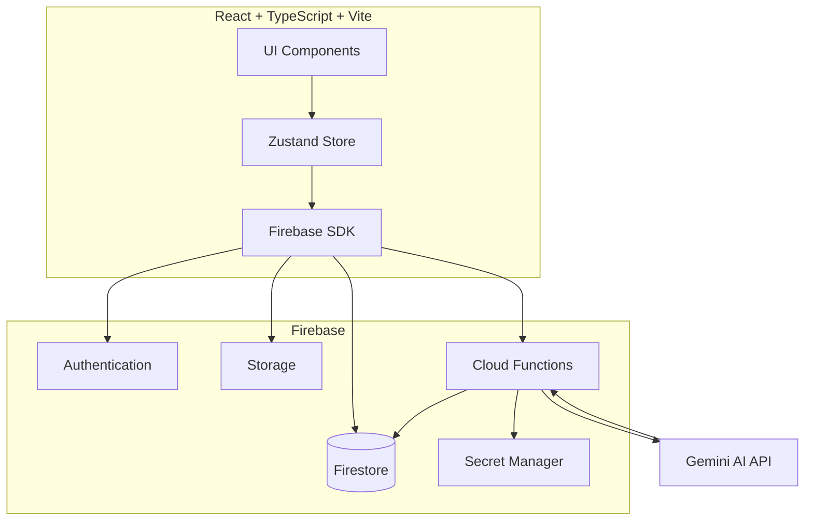
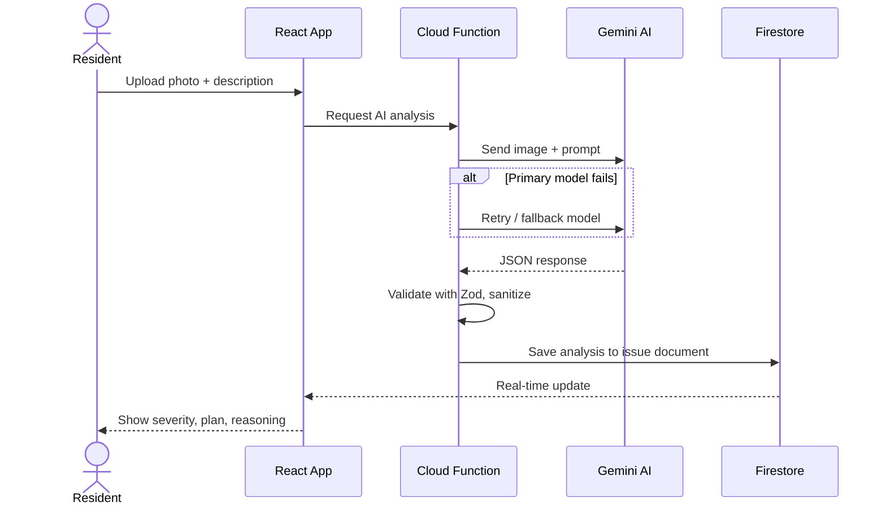

<div align="center">

<h1> CivicPulse AI</h1>

<p>
  <strong>An AI-assisted civic issue platform for apartment societies.</strong><br/>
  Residents report issues with a photo. Gemini AI analyzes severity and suggests a plan. RWAs review and act faster.
</p>

<br/>

<a href="https://www.codingninjas.com/">
  
</a>
&nbsp;

<br/><br/>


&nbsp;
&nbsp;
&nbsp;
&nbsp;
&nbsp;
&nbsp;

</div>

<br/>

---

## Table of Contents

- [Why CivicPulse AI?](#why-civicpulse-ai)
- [Overview](#overview)
- [Features](#features)
- [Innovation](#innovation)
- [Architecture](#architecture)
- [AI Workflow](#ai-workflow)
- [Tech Stack](#tech-stack)
- [Demo](#demo)
- [Screenshots](#screenshots)
- [Installation](#installation)
- [Security](#security)
- [Expected Impact](#expected-impact)
- [Future Scope](#future-scope)
- [Contributing](#contributing)
- [License](#license)
- [Author](#author)

---

## Why CivicPulse AI?

Most complaint systems stop at reporting. A resident files a complaint, and then nothing — no analysis, no priority, no plan. Someone on the committee still has to look at it, figure out how serious it is, and decide what to do.

CivicPulse AI goes one step further. When a resident reports an issue with a photo, the app does not just store it — it analyzes it. Gemini AI looks at the image, estimates how severe the issue is, explains why, suggests which committee should handle it, and proposes an action plan. The admin sees this directly on the dashboard instead of starting from a blank complaint.

In short:

- Traditional systems collect complaints. CivicPulse AI helps understand them.
- It generates a structured plan instead of just a status field.
- It suggests which committee is responsible.
- It explains its reasoning, so admins are not blindly trusting a black box.
- It summarizes community comments so admins do not have to read every single one.
- The goal is faster, clearer decisions for the people running the society.

---

## Overview

### The Problem

Residential societies in India largely manage civic issues through WhatsApp groups and verbal complaints to the watchman or RWA office. This creates real problems:

- No record of what was reported, when, or by whom.
- No way to tell which issues are urgent and which can wait.
- Residents get no visibility into whether their issue was even seen.
- Committees spend time reading and triaging complaints manually before any work can start.

### Why Existing Solutions Fall Short

Generic complaint-tracking tools exist, but they are essentially digital forms — a resident types a description, it sits in a list, and a human still has to read it, judge its severity, and figure out what to do. They do not understand images, do not estimate urgency, and do not produce any kind of action plan. The admin still does all the thinking.

### How CivicPulse AI Solves It

CivicPulse AI replaces the blank complaint form with an AI-assisted reporting flow. A resident uploads a photo and a short description. Gemini AI analyzes the image, estimates severity, suggests a responsible committee, and proposes an action plan with reasoning attached. The admin dashboard surfaces this analysis directly, so the first decision an admin makes is "accept this plan" or "update status" — not "figure out what this complaint even means."

| Capability | Typical Complaint Tools | CivicPulse AI |
|---|---|---|
| Issue submission | Text only | Photo + description + location details |
| Understanding the issue | Manual reading | Gemini image analysis |
| Severity judgment | Manual, inconsistent | AI severity estimate with confidence score |
| Suggested next step | None | AI action plan + suggested committee |
| AI transparency | N/A | Reasoning panel shows why |
| Community input | Rarely supported | Voting + comments + AI feedback summary |
| Admin starting point | Blank complaint | Pre-analyzed issue with a plan to review |

---

## Features

### Resident

- Sign in with Google
- Report a civic issue
- Upload an image of the issue
- Add a text description
- Capture issue location details
- View AI image analysis on the submitted issue
- View AI severity estimate
- View AI confidence score
- View AI-suggested responsible committee
- View AI action plan
- View AI reasoning panel (why the AI reached this conclusion)
- View AI-suggested temporary actions
- View AI-suggested next steps
- Upvote issues reported by others
- Comment on issues
- View AI-generated summary of community comments
- Notification center
- Resident dashboard
- Issue details page

### Admin

- Admin dashboard
- KPI cards (issue counts and key numbers at a glance)
- Review reported issues
- View full AI analysis per issue
- Accept the AI-suggested action plan
- Update issue status
- Notification center

### AI (Gemini)

- Understands the uploaded image, not just the text description
- Returns a structured JSON response (not free-form text)
- Includes a reasoning panel — the AI explains why it reached its conclusion
- Multi-model fallback — if the primary model fails or is unavailable, the system falls back to an alternate model
- Automatic retry on failed AI calls
- JSON sanitization on the AI response before it is used
- Confidence estimation on the analysis
- Suggests the committee likely responsible for the issue
- Generates a resolution / action plan

### Backend

- Firebase Authentication
- Cloud Firestore as the database
- Firebase Storage for issue images
- Firebase Cloud Functions for AI calls
- Gemini API key stored in Firebase Secret Manager (not in client code)
- Cloud Function response validated with Zod schemas before being trusted
- AI analysis results are written back to Firestore by the Cloud Function

### UI

- Responsive layout
- Mobile-friendly notification panel
- Loading animation while AI analysis runs
- Completion animation when AI analysis finishes
- Empty states for lists with no data yet
- Glassmorphism navbar
- Card-based layout for issues and dashboard widgets
- KPI-style dashboard for admins

---

## Innovation

What makes CivicPulse AI different is not the photo upload — that part is easy. The differentiator is what the AI does with the photo after it is uploaded:

- **Multimodal AI analysis** — Gemini reads the image directly, not just the resident's text.
- **Explainable AI** — every AI output comes with a reasoning panel, so the admin can see why the AI rated something a certain way instead of trusting an opaque score.
- **AI-generated action plans** — the AI does not just classify the issue, it proposes what to do next and who should handle it.
- **Community feedback summarization** — comments on an issue are summarized by AI instead of requiring an admin to read each one.
- **Reliability layer** — the AI pipeline includes retry logic, multi-model fallback, and JSON sanitization, so a single bad or malformed model response does not break the flow.

---

## Architecture



The frontend talks to Firebase directly for authentication, data, and file storage. AI calls go through a Cloud Function so the Gemini API key stays on the server side and is never exposed to the browser.

---

## AI Workflow



The Cloud Function retrieves the Gemini API key from Secret Manager at call time, sends the image and description to Gemini, validates the structured response with Zod, and writes the result back to the issue's Firestore document. The resident and admin both see the result update live.

---

## Tech Stack

| Layer | Technology |
|---|---|
| Frontend Framework | React |
| Language | TypeScript |
| Build Tool | Vite |
| Styling | Tailwind CSS |
| State Management | Zustand |
| Authentication | Firebase Authentication (Google Sign-In) |
| Database | Cloud Firestore |
| File Storage | Firebase Storage |
| Backend Logic | Firebase Cloud Functions |
| AI Model | Google Gemini (with automatic fallback) |
| Secrets | Firebase Secret Manager |
| Validation | Zod |

---

## Demo

| | |
|---|---|
| **Live Demo** | _https://civicpulse-ai-e8baf.web.app_ |
| **Demo Video** | _https://drive.google.com/file/d/1gFpZbDcRSM4UQbu1RvEJCkiqvHA9ZSFc/view?usp=drivesdk_ |
| **GitHub Repository** | [github.com/AdityaJaiswal-07/CivicPulse-AI](https://github.com/AdityaJaiswal-07/CivicPulse-AI) |

---
## Screenshots

<table>
  <tr>
    <td align="center">
      <strong>🔐 Sign In Portal</strong><br/>
      
    </td>
    <td align="center">
      <strong>📝 Report an Issue</strong><br/>
      
    </td>
  </tr>
  <tr>
    <td align="center">
      <strong>🧠 AI Resolution & Explainability</strong><br/>
      
    </td>
    <td align="center">
      <strong>🏠 Resident Community Feed</strong><br/>
      
    </td>
  </tr>
  <tr>
    <td align="center">
      <strong>🔎 Issue Tracking & Detail View</strong><br/>
      
    </td>
    <td align="center">
      <strong>🛡️ Admin Command Dashboard</strong><br/>
      
    </td>
  </tr>
</table>

---

## Installation

### Prerequisites

- Node.js 20+
- npm
- A Firebase project on the Blaze plan (required for Cloud Functions)
- A Gemini API key from [Google AI Studio](https://aistudio.google.com/app/apikey)

### 1. Clone the repository

```bash
git clone https://github.com/AdityaJaiswal-07/CivicPulse-AI.git
cd CivicPulse-AI
```

### 2. Install frontend dependencies

```bash
npm install
```

### 3. Set environment variables

Create a `.env` file in the project root with your Firebase web app config:

```env
VITE_FIREBASE_API_KEY=your_firebase_api_key
VITE_FIREBASE_AUTH_DOMAIN=your_project.firebaseapp.com
VITE_FIREBASE_PROJECT_ID=your_project_id
VITE_FIREBASE_STORAGE_BUCKET=your_project.appspot.com
VITE_FIREBASE_MESSAGING_SENDER_ID=your_sender_id
VITE_FIREBASE_APP_ID=your_app_id
```

### 4. Set up Firebase

```bash
firebase login
firebase use --add
```

Enable Authentication (Google Sign-In), Firestore, and Storage in the Firebase console.

### 5. Set up Cloud Functions

```bash
cd functions
npm install
```

Store your Gemini API key in Secret Manager:

```bash
echo -n "your_gemini_api_key" | gcloud secrets create GEMINI_API_KEY --data-file=-
```

Deploy functions:

```bash
cd ..
firebase deploy --only functions
```

### 6. Run locally

```bash
npm run dev
```

The app runs at `http://localhost:5173`.

### 7. Deploy

```bash
npm run build
firebase deploy
```

---

## Security

This is what is actually in place today:

- All Firestore, Storage, and Cloud Function access requires an authenticated Firebase user.
- The Gemini API key is stored in Firebase Secret Manager and never appears in client-side code.
- Cloud Function responses from Gemini are validated against a Zod schema before being written to the database, which helps reject malformed AI output.

This is what is **not** in place yet, and should not be assumed:

- Role-based Firestore security rules (admin vs. resident write permissions are not yet enforced at the rules level)
- UID-isolated Storage rules
- Society-level data isolation
- Custom Claims for role management
- Firebase App Check or abuse prevention

These are listed honestly in [Future Scope](#future-scope) rather than claimed as done.

---

## Expected Impact

- Faster complaint resolution, since admins start from an AI-generated plan instead of a blank complaint.
- Less manual triage work for RWA committees.
- Better transparency for residents, who can see the status and reasoning behind their issue.
- More community participation through voting and commenting.
- AI-assisted decision-making that supports the admin rather than replacing their judgment.

---

## Future Scope

- Role-based Firestore security rules
- UID-isolated Storage rules
- Society-level data isolation (multi-society support)
- Custom Claims for proper role management
- Push notifications
- Google Maps integration for issue location
- Vendor management and assignment
- Analytics dashboard (resolution time trends, issue heatmaps)
- Predictive maintenance based on historical issue data

---

## Contributing

Contributions are welcome.

1. Fork the repository.
2. Create a branch: `git checkout -b feat/your-feature-name`
3. Install dependencies and run the app locally: `npm install && npm run dev`
4. Make your changes.
5. Run lint before committing: `npm run lint`
6. Commit with a clear message and open a pull request against `main`.

Please do not commit `.env` files, API keys, or credentials. For larger changes, open an issue first to discuss the approach.

---

## Author

<div align="center">

<a href="https://github.com/AdityaJaiswal-07">
  
</a>

<br/>

**Aditya Jaiswal**

<a href="https://github.com/AdityaJaiswal-07">
  
</a>

<br/><br/>

Built for the Coding Ninjas × Google for Developers — Vibe2Ship Hackathon

</div>
